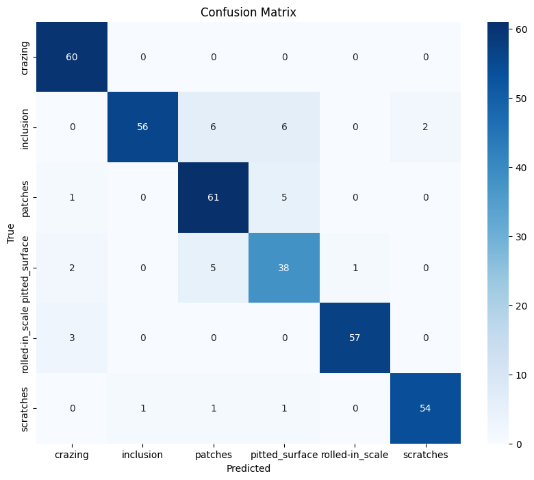

# Surface Defect Classification Using Xception Model
"Machine learning project using TensorFlow and the Xception model to classify surface defects in images from the NEU Surface Defect Database."

## Project Overview

This project applies deep learning techniques to classify surface defects in manufacturing using the Xception convolutional neural network model. Utilizing TensorFlow and Keras, the model is trained on the NEU Surface Defect Database to identify six types of surface defects. This project showcases the efficacy of transfer learning for image classification tasks in industrial applications.

## Dataset

The dataset used is the NEU Surface Defect Database, which contains images of metal surfaces with six kinds of defects: crazing, inclusion, patches, pitted surface, rolled-in scale, and scratches.

Dataset can be downloaded from Kaggle: [NEU Surface Defect Database](https://www.kaggle.com/datasets/kaustubhdikshit/neu-surface-defect-database).

## Dataset Structure

dataset/
├── train/
│   ├── annotations/ # contains XML files
│   └── images/      # contains subfolders for each class with images
└── validation/
    ├── annotations/ # contains XML files
    └── images/      # contains subfolders for each class with images

## Features

- Conversion of images and annotations to TFRecord format for efficient loading.
- Preprocessing pipeline including normalization and resizing of images.
- Transfer learning with the Xception model pre-trained on ImageNet.
- Fine-tuning of the model with a custom head for defect classification.
- Evaluation of model performance using a confusion matrix and other metrics.

## Prerequisites

- TensorFlow 2.15
- Python 3.x

## Usage

Detailed instructions on training the model, evaluating its performance, and making predictions are provided in the Jupyter notebook `script.ipynb`.

## Confusion Matrix

## References

- Chollet, François. "Xception: Deep Learning with Depthwise Separable Convolutions." Proceedings of the IEEE conference on computer vision and pattern recognition.2017.
- TensorFlow API documentation: [https://www.tensorflow.org/api_docs](https://www.tensorflow.org/api_docs)
- https://github.com/siddhartamukherjee/NEU-DET-Steel-Surface-Defect-Detection
- https://akbarikevin.medium.com/neu-surface-defect-dataset-with-tensorflow-api-8753c85fe783 : NEU Surface Defect Dataset with Tensorflow API

## Acknowledgments

- Kaggle for providing the dataset.
- TensorFlow and Keras teams for their amazing work.

